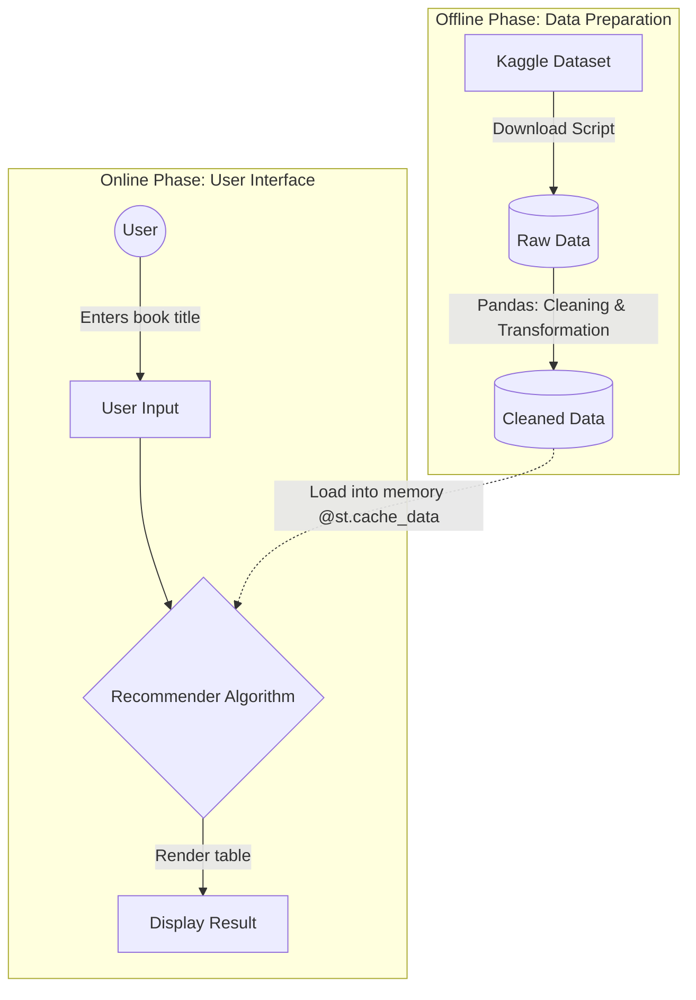

# Book Recommender

This project was created as a take-home interview task focused on productionalizing a PoC book recommendation script. The current version covers data download, basic data cleaning, a parameterized recommendation script, and a simple Streamlit frontend prototype.

## Project Goal

The original recommendation script worked as a proof of concept, but it was hardcoded, not easy to reuse. The goal of this project was to turn that script into a more usable prototype with a simple data pipeline, cleaner input data, and a lightweight user interface (optional).

## Architecture



Main components:
- `src/data/download.py` downloads the dataset from Kaggle into `data/raw`
- `src/data/clean.py` loads raw data and produces cleaned CSV files in `data/cleaned`
- `src/model/book_rec.py` computes recommendations for a selected book
- `src/app/app.py` provides a simple Streamlit interface for user input and result display

## Project Structure

```text
src/
  app/
    app.py
  data/
    download.py
    clean.py
  model/
    book_rec.py
data/
  raw/
  cleaned/
docs/
  CODE_REVIEW.md
README.md
requirements.txt
```

## Data Pipeline

The project currently follows this flow:

1. Download raw CSV files from Kaggle.
2. Store them in `data/raw`.
3. Clean the books and ratings datasets.
4. Save cleaned outputs into `data/cleaned`.
5. Use the cleaned data in the recommendation model.
6. Show recommendations in the Streamlit frontend.

## Data Cleaning

The cleaning step currently includes these basic improvements:

- skip broken CSV rows during loading
- remove duplicate books by `ISBN`
- remove duplicate ratings by `User-ID` and `ISBN`
- remove ratings with value `0`
- keep only ratings for books that exist in the books dataset
- filter invalid publication years
- remove unnecessary image URL columns
- trim whitespace in key text columns

## Recommendation Approach

The recommendation logic is based on the original proof-of-concept script.

High-level approach:

1. Load cleaned books and ratings data.
2. Merge both datasets by `ISBN`.
3. Find users who rated the selected book.
4. Collect other books rated by those users.
5. Build a user-book rating matrix.
6. Compute correlation between the selected book and other books.
7. Return the top recommended books.


## How To Run

### 1. Clone the repository

```bash
git clone https://github.com/danielkarcz14/book-recommender.git
cd book-recommender
```

### 2. Install dependencies

```bash
python -m pip install -r requirements.txt
```

### 3. Configure Kaggle credentials

You can authenticate to Kaggle either by:

- setting `KAGGLE_USERNAME` and `KAGGLE_KEY`
- or using `~/.kaggle/kaggle.json`
- more here: https://github.com/Kaggle/kaggle-cli/blob/main/docs/README.md

### 4. Download raw data

```bash
python src/data/download.py
```

### 5. Clean the data

```bash
python src/data/clean.py
```

### 6. Run the Streamlit app

```bash
python -m streamlit run src/app/app.py
```

## Current Features

- Kaggle dataset download script
- basic data cleaning pipeline
- recommendation generation for a selected book
- simple Streamlit frontend prototype
- cached loading of cleaned data in the app/model flow

## Limitations

TODO

## Future Improvements

TODO

## Code Review

Code review notes for provided PoC script in `docs/CODE_REVIEW.md`.
